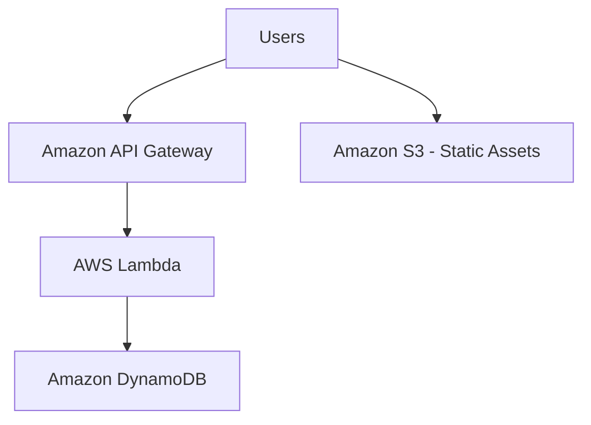

# Serverless AWS Web Application


**API Gateway + Lambda + DynamoDB + S3 (Fully Serverless Reference Architecture)**

This project demonstrates a **fully serverless AWS web application** designed to scale automatically with minimal operational overhead. The architecture relies entirely on managed AWS services to handle routing, compute, persistence, and storage without managing servers or scaling policies.

This project intentionally focuses on **cloud-native serverless tradeoffs** and complements an infrastructure-managed AWS project built using EC2 and load balancers.


## Problem Statement
Some applications require:
- Rapid scalability with unpredictable traffic
- Minimal infrastructure management
- High availability by default
- Cost efficiency for low-to-medium workloads

The challenge is to design a system that meets these requirements while understanding the **limitations and tradeoffs** introduced by fully managed abstractions.


## Architecture

### Architecture Diagram



### Key Components
- **API Gateway** — HTTP routing, throttling, and request handling
- **AWS Lambda** — Stateless compute for application logic
- **DynamoDB** — Fully managed NoSQL datastore with automatic scaling
- **Amazon S3** — Durable object storage for static assets


## Design Decisions

### Why Serverless (Lambda + API Gateway)
This architecture prioritizes:
- Zero server management
- Automatic horizontal scaling
- Built-in high availability
- Pay-per-request cost model

By using Lambda, the application avoids managing:
- Instance lifecycles
- Load balancers
- Scaling policies
- Operating system configuration

This makes the system well-suited for workloads with variable or bursty traffic.


### Why DynamoDB Instead of a Relational Database
DynamoDB was chosen to:
- Eliminate connection pooling concerns with Lambda
- Scale automatically with concurrent requests
- Reduce operational complexity

Tradeoffs include reduced support for complex relational queries and joins, which are acceptable for this application’s access patterns.


## Failure Scenarios & Behavior

| Failure Scenario | System Behavior |
|------------------|----------------|
| Lambda invocation failure | Isolated to a single request |
| Traffic spike | Lambda and DynamoDB scale automatically |
| AZ-level failure | Managed services remain available |
| Individual request error | No impact on other users |

The system favors **availability and simplicity** over low-level infrastructure control.


## Observability
- **CloudWatch Logs** for Lambda execution output
- **CloudWatch Metrics** for latency, errors, and invocation count
- **API Gateway metrics** for request volume and error rates

Observability is provided through managed AWS tooling without custom monitoring infrastructure.


## Tradeoffs & Alternatives

### Serverless vs Server-Based Architectures

**Benefits**
- Minimal operational overhead
- Automatic scaling
- Faster iteration and deployment
- Reduced infrastructure complexity

**Tradeoffs**
- Limited control over runtime environment
- Cold start latency
- Harder to reason about concurrency limits
- Less visibility into underlying infrastructure behavior

A separate AWS project explores these concerns using EC2 Auto Scaling and load balancers.

## Observability
- CloudWatch Logs for Lambda execution output
- CloudWatch Metrics for Lambda errors/latency/invocations
- API Gateway metrics for request volume and error rates


## Repository Structure
aws-severless-application
├── html/              # Static frontend assets (served from S3)
├── lambda/            # Lambda function code
├── main.tf            # Terraform infrastructure
├── variables.tf       # Terraform variables
└── README.md


## What This Project Demonstrates
- Serverless application design using managed AWS services
- Automatic scaling under variable traffic
- Practical reasoning about tradeoffs (cold starts, limits, observability)
- Terraform-based infrastructure provisioning (IaC)


## Deployment


### Requirements
- Serverless application design using managed AWS services
- Automatic scaling under variable traffic
- Practical reasoning about tradeoffs (cold starts, limits, observability)
- Terraform-based infrastructure provisioning (IaC)

Verify:
```bash
aws --version
terraform -version
```

### Deploy

Navigate to folder, initialize, and deploy project
```bash
git clone https://github.com/ocean-projects/aws-serverless-application.git
cd aws-serverless-application
terraform init
terraform plan
terraform apply
```

Confirm with yes when prompted.

After apply, check Terraform outputs:

```bash
terraform output
```

### Test

1) Test the API

```bash
curl https://<api_gateway_invoke_url>/health
```

(Adjust the path to whatever your Lambda/API exposes.)

2) Test the website

Open the S3/website URL from terraform output (or from the S3 static website hosting config).


### Destroy

```bash
terraform destroy
```

Always destroy unused infrastructure to avoid AWS charges.


Use the API endpoint from terraform output:

## Status
**Feature-complete.**

Scope is intentionally frozen to preserve clarity and to serve as a comparison point against infrastructure-managed AWS architectures.


