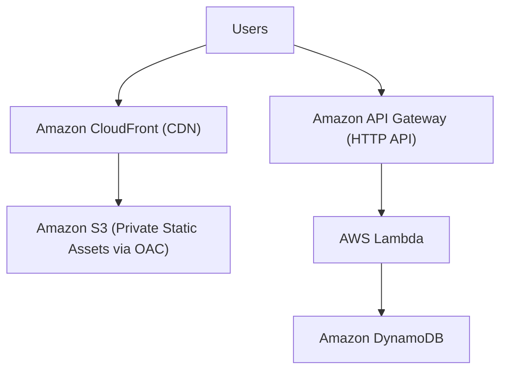
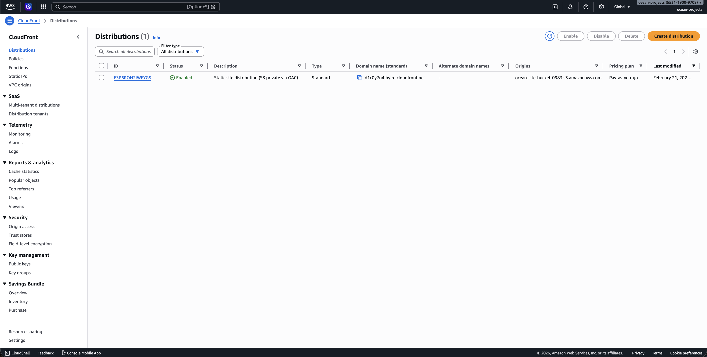
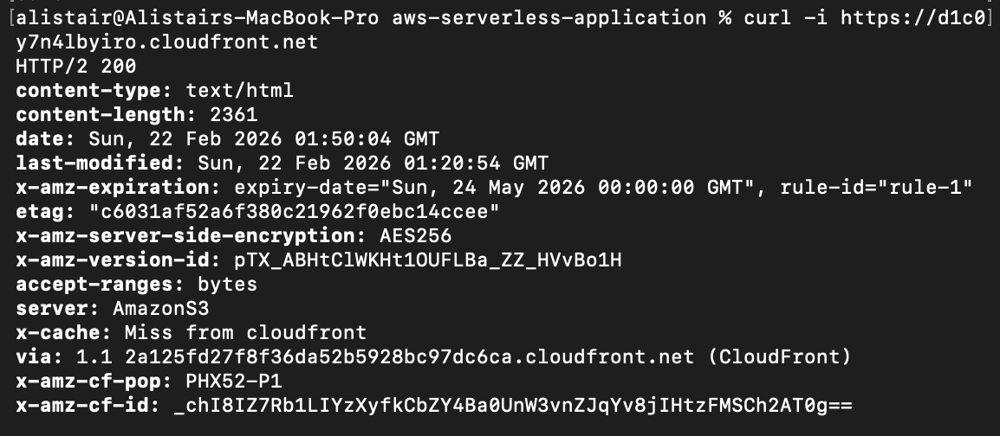
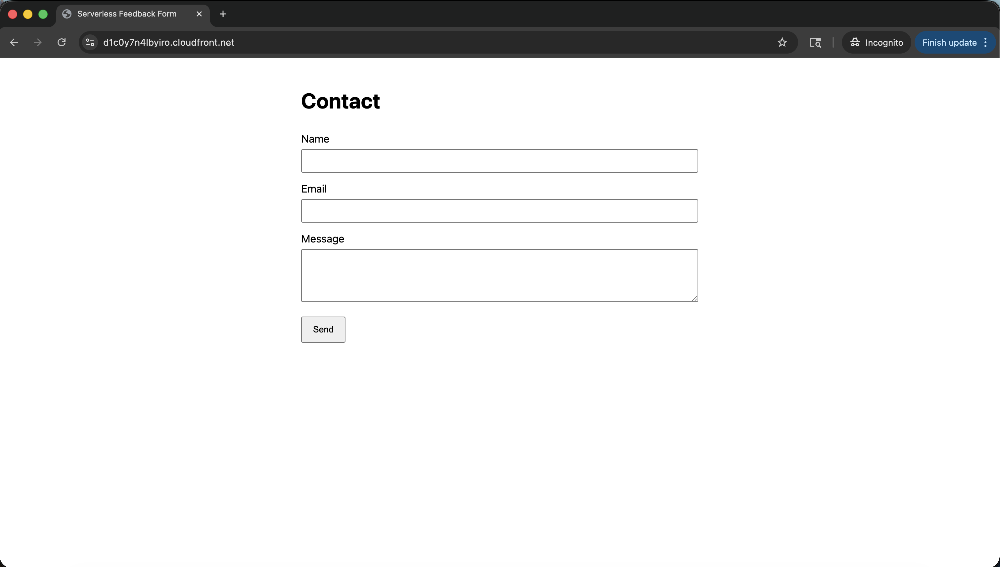
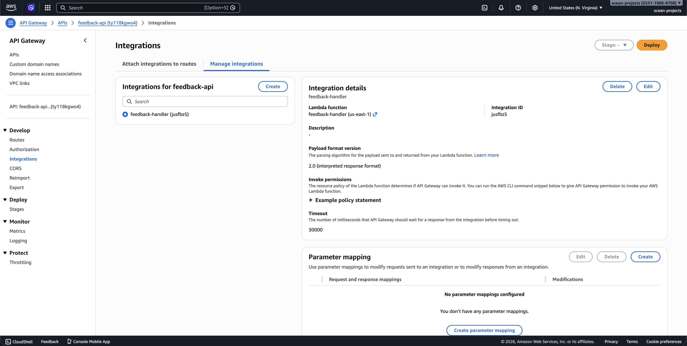
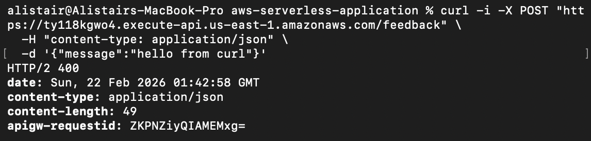
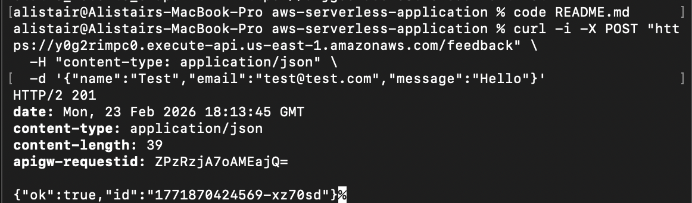
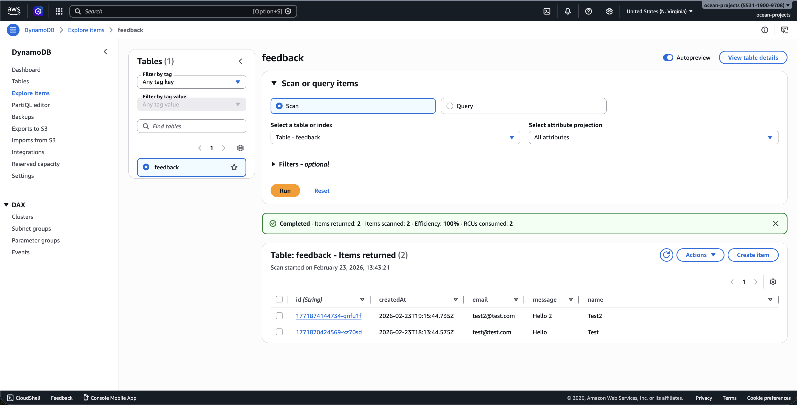
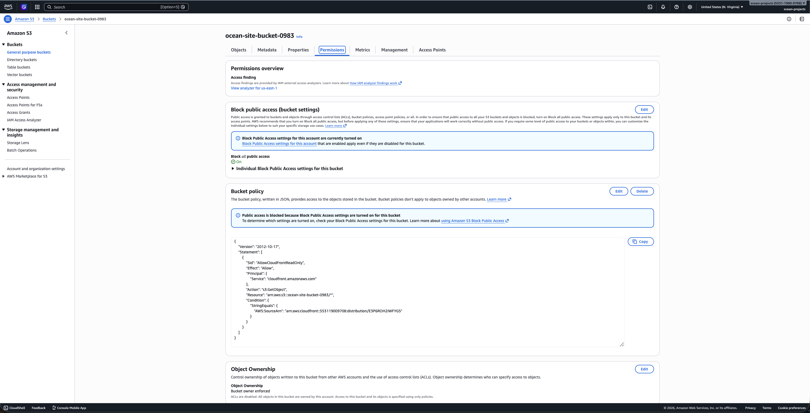
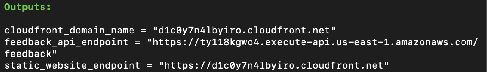

# Serverless AWS Web Application

[](https://github.com/ocean-projects/aws-serverless-application/actions/workflows/terraform-ci.yml)

**CloudFront + API Gateway + Lambda + DynamoDB + Private S3 (Fully Serverless Reference Architecture)**

This project demonstrates a fully serverless AWS web application built entirely on managed services. The architecture is designed for automatic scaling, high availability, strong security posture, and minimal operational overhead.

Static assets are delivered globally via Amazon CloudFront using Origin Access Control (OAC) to enforce private S3 access. Application logic is handled by Lambda and API Gateway, and data persistence is managed by DynamoDB.

This project complements a separate infrastructure-managed AWS project built using EC2 and load balancers to contrast serverless and server-based architectures.


## Problem Statement

Some applications require:

- Rapid scalability with unpredictable traffic  
- Minimal infrastructure management  
- High availability by default  
- Cost efficiency for low-to-medium workloads  

The challenge is designing a system that satisfies these constraints while understanding the tradeoffs introduced by fully managed abstractions.


## Architecture

### Architecture Diagram



### Key Components
- **Amazon CloudFront** — Global CDN delivering static assets securely over HTTPS
- **Origin Access Control (OAC)** — Restricts S3 access so only CloudFront can read objects
- **API Gateway** — HTTP routing, throttling, and request handling
- **AWS Lambda** — Stateless compute for application logic
- **DynamoDB** — Fully managed NoSQL datastore with automatic scaling
- **Amazon S3** — Durable object storage for static assets


## Architecture & Deployment Screenshots


### CloudFront Distribution (Private S3 via OAC)

CloudFront serves the static frontend globally over HTTPS.  
The S3 bucket remains private and is accessible only through Origin Access Control (OAC).




### CloudFront 200 Response (Live Endpoint)

Terminal validation CDN is serving the application successfully over HTTPS.




### Serverless Feedback Form (Frontend)

Static frontend hosted on S3 and delivered via CloudFront.




### API Gateway → Lambda Integration

The `POST /feedback` route uses AWS_PROXY integration to invoke the `feedback-handler` Lambda function.




### API Validation (400 Response)

Input validation enforced at the Lambda layer.  
Invalid requests return structured 400 responses.




### Lambda Test (201 Created)

Direct Lambda test invocation confirming:
- Request parsing
- Validation
- DynamoDB persistence
- 201 Created response




### DynamoDB Persistence

Successful submissions are stored in the `feedback` table using on-demand billing.




### S3 Private Bucket Configuration

Block Public Access enabled.  
Bucket policy restricts read access to CloudFront distribution only.




### S3 Bucket Contents

Static assets (`index.html`, `error.html`) stored in private S3 bucket.


### Terraform Deployment Outputs

Infrastructure provisioned using Terraform.  
Outputs confirm CloudFront and API Gateway endpoints.



## Design Decisions

### Why Serverless (Lambda + API Gateway)
This architecture prioritizes:
- Zero server management
- Automatic horizontal scaling
- Built-in high availability
- Pay-per-request cost model

By using Lambda, the application avoids managing:
- Instance lifecycles
- Load balancers
- Scaling policies
- Operating system configuration

This makes the system well-suited for workloads with variable or bursty traffic.


### Why DynamoDB Instead of a Relational Database
DynamoDB was chosen to:
- Eliminate connection pooling concerns with Lambda
- Scale automatically with concurrent requests
- Reduce operational complexity

Tradeoffs include reduced support for complex relational queries and joins, which are acceptable for this application’s access patterns.


### Why CloudFront + Origin Access Control

Instead of exposing an S3 static website endpoint publicly:

- S3 remains fully private  
- CloudFront is the only service allowed to access bucket objects  
- All traffic is delivered via HTTPS  
- Global edge caching reduces latency  

This improves security posture while maintaining serverless simplicity.


## Failure Scenarios & Behavior

| Failure Scenario | System Behavior |
|------------------|----------------|
| Lambda invocation failure | Isolated to a single request |
| Traffic spike | Lambda and DynamoDB scale automatically |
| AZ-level failure | Managed services remain available |
| Individual request error | No impact on other users |
| CloudFront edge failure | Requests route to nearest healthy edge |
| Individual request error | No impact on other users |


The system favors **availability and simplicity** over low-level infrastructure control.


## Observability
- **CloudWatch Logs** for Lambda execution output
- **CloudWatch Metrics** for latency, errors, and invocation count
- **API Gateway metrics** for request volume and error rates
- **CloudFront metrics** for cache hit rate and edge performance

Observability is provided through managed AWS tooling without custom monitoring infrastructure.


## Tradeoffs & Alternatives

### Serverless vs Server-Based Architectures

**Benefits**
- Minimal operational overhead
- Automatic scaling
- Faster iteration and deployment
- Reduced infrastructure complexity

**Tradeoffs**
- Limited control over runtime environment
- Cold start latency
- Harder to reason about concurrency limits
- Less visibility into underlying infrastructure behavior

A separate AWS project explores these concerns using EC2 Auto Scaling and load balancers.


## Observability
- CloudWatch Logs for Lambda execution output
- CloudWatch Metrics for Lambda errors/latency/invocations
- API Gateway metrics for request volume and error rates


## Repository Structure
aws-severless-application
├── images/            # Deployment images
├── html/              # Static frontend assets (served from S3)
├── lambda/            # Lambda function code
├── main.tf            # Terraform infrastructure
├── variables.tf       # Terraform variables
└── README.md


## What This Project Demonstrates
- Secure static asset delivery using CloudFront + Origin Access Control
- Serverless application design using managed AWS services
- DynamoDB persistence with on-demand billing
- Automatic scaling under variable traffic
- Practical reasoning about tradeoffs (cold starts, limits, observability)
- Terraform-based infrastructure provisioning (IaC)


## Deployment


### Requirements
- Serverless application design using managed AWS services
- Automatic scaling under variable traffic
- Practical reasoning about tradeoffs (cold starts, limits, observability)
- Terraform-based infrastructure provisioning (IaC)

Verify:
```bash
aws --version
terraform -version
```

### Deploy

Navigate to folder, initialize, and deploy project
```bash
git clone https://github.com/ocean-projects/aws-serverless-application.git
cd aws-serverless-application
terraform init
terraform plan
terraform apply
```

Confirm with yes when prompted.

After apply, check Terraform outputs:

```bash
terraform output
```

### Test

1) Test the API

```bash
curl https://<api_gateway_invoke_url>/health
```

(Adjust the path to whatever your Lambda/API exposes.)

2) Test the website

Open the S3/website URL from terraform output (or from the S3 static website hosting config).


### Destroy

```bash
terraform destroy
```

Always destroy unused infrastructure to avoid AWS charges.


Use the API endpoint from terraform output:


## Status
**Feature-complete.**

Scope is intentionally frozen to preserve clarity and to serve as a comparison point against infrastructure-managed AWS architectures.


